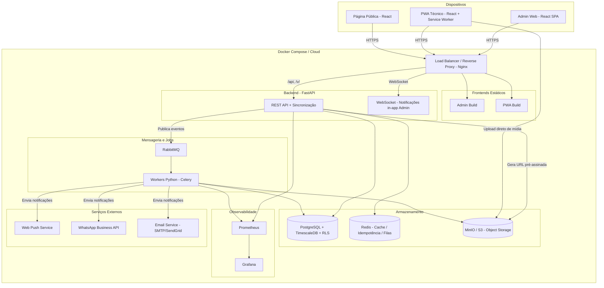

# Diagrama de Arquitetura de Alto Nível — FieldOps

## Apresentação

Este diagrama representa a arquitetura de alto nível da plataforma FieldOps, abrangendo
todos os componentes principais do sistema e suas interações. A arquitetura foi desenhada
para atender aos requisitos de uma aplicação field-service com suporte offline-first,
processamento assíncrono de mídia e notificações multicanal.

O sistema é composto por três grandes blocos:

- **Dispositivos:** os três pontos de entrada da aplicação — o painel administrativo web
  (React SPA) para operadores de escritório, o PWA (React + Service Worker) para técnicos
  em campo com suporte offline, e a página pública para clientes finais acompanharem o
  status da visita sem autenticação.

- **Docker Compose / Cloud:** o núcleo da plataforma, contendo o backend FastAPI, bancos
  de dados e storage, message broker com workers Celery, e serviços auxiliares de
  observabilidade.

- **Serviços Externos:** integrações com Web Push (notificações nativas para o PWA),
  WhatsApp Business API, e serviços de e-mail transacional (SendGrid/SMTP).

## Componentes principais

| Componente | Tecnologia | Responsabilidade |
|------------|------------|------------------|
| Admin Web | React SPA (Vite + TypeScript + Tailwind) | Interface do operador administrativo para agendamento, monitoramento e relatórios |
| PWA Técnico | React PWA (Vite + Service Worker + Dexie.js) | Aplicativo instalável dos técnicos de campo com suporte offline completo |
| Página Pública | React (servida pelo Admin) | Página de acompanhamento do cliente final via token público |
| Load Balancer | Nginx | Proxy reverso, terminação SSL, roteamento de rotas |
| Backend API | FastAPI (Python 3.12+) | API REST, autenticação JWT, sincronização offline, geração de URLs pré-assinadas |
| WebSocket | FastAPI (WebSocket) | Notificações em tempo real para o painel admin |
| PostgreSQL | PostgreSQL 15 + TimescaleDB + RLS | Banco primário: dados transacionais, séries temporais, isolamento multi-tenant |
| Redis | Redis 7 | Cache de sessões, chaves de idempotência, filas pub/sub leves |
| MinIO | MinIO / S3-compatible | Object storage para fotos e anexos dos técnicos |
| RabbitMQ | RabbitMQ 3 | Message broker para tarefas assíncronas (processamento de fotos, notificações) |
| Workers | Celery (Python) | Consumidores de filas: processamento de imagens, envio de notificações |
| Prometheus + Grafana | Prometheus + Grafana | Coleta de métricas e dashboards de observabilidade |

## Protocolos de comunicação

- **HTTPS:** entre dispositivos e o load balancer
- **HTTP:** do load balancer para os serviços internos (frontends estáticos, API)
- **WebSocket:** do load balancer para o backend (notificações in-app)
- **AMQP:** da API para o RabbitMQ (publicação de tarefas assíncronas)
- **S3 API:** do PWA diretamente para o MinIO (upload de mídia com URL pré-assinada)

## Fluxos principais

1. **Operação online:** Admin Web → Nginx → FastAPI → PostgreSQL/Redis
2. **Sincronização offline:** PWA (IndexedDB) → ao reconectar → FastAPI `/api/sync` →
   validação de estado → resposta 200/409
3. **Upload de mídia:** PWA → solicita URL pré-assinada → FastAPI → upload direto ao MinIO →
   confirmação de metadados → processamento assíncrono via RabbitMQ/Workers
4. **Notificações (V1+):** Workers → Web Push (técnico) / WhatsApp (cliente) / E-mail
   (operador)

## Notas de design

- **TimescaleDB** é habilitado como extensão do PostgreSQL desde o MVP. As tabelas
  `EventoVisita` e `TentativaSincronizacao` são hypertables, permitindo consultas
  temporais eficientes e análise de tendências sem migração futura.
- **RLS (Row-Level Security)** implementa o isolamento multi-tenant diretamente no banco
  (ADR 4), garantindo que cada empresa enxergue apenas seus próprios dados.
- **RabbitMQ** é o message broker principal para tarefas assíncronas de longa duração. Redis
  é reservado para cache e operações de baixa latência (idempotência, sessões).
- A página pública do cliente (`/v/<token>`) é servida como uma rota dentro do Admin SPA,
  compartilhando a mesma infraestrutura de build e deploy.

## Diagrama

