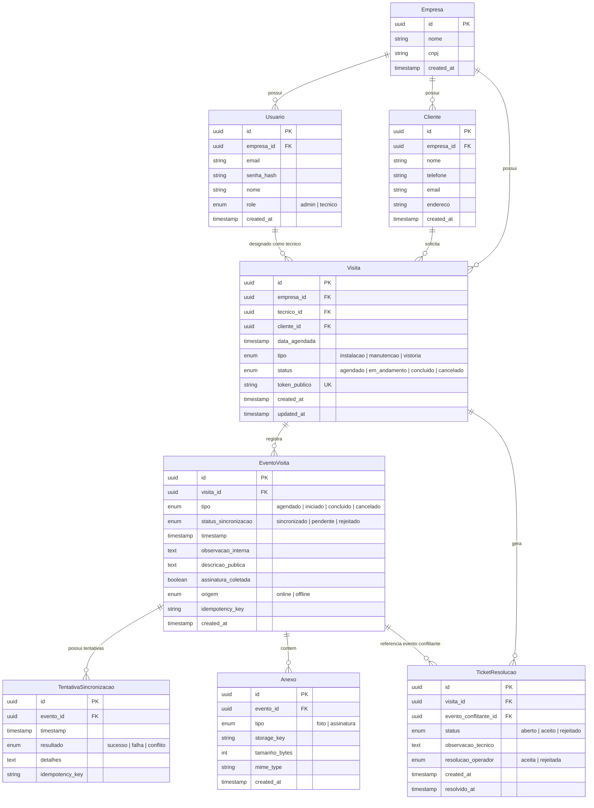

# Modelo de Dados — Diagrama Entidade-Relacionamento (ERD)

## Apresentação

Este diagrama representa o modelo de dados relacional da plataforma FieldOps, projetado
para suportar o fluxo completo de gestão de visitas técnicas com operação offline e
resolução de conflitos. O modelo foi desenhado sobre PostgreSQL com extensão TimescaleDB
e Row-Level Security (RLS) para isolamento multi-tenant.

## Entidades principais

| Entidade | Descrição | Responsabilidade |
|----------|-----------|------------------|
| **Empresa** | Cliente contratante da plataforma (tenant) | Raiz do isolamento multi-tenant. Todas as demais entidades são vinculadas a uma empresa. |
| **Usuario** | Operadores administrativos e técnicos de campo | Autenticação e autorização (RBAC). O campo `role` define o nível de acesso. |
| **Cliente** | Consumidor final (dono da planta solar) | Destinatário das visitas técnicas. Recebe link público para acompanhamento. |
| **Visita** | Ordem de serviço agendada | Entidade central do sistema. Possui token público único para acesso do cliente final. |
| **EventoVisita** | Cada mudança de estado da visita | Timeline de eventos (agendamento, início, conclusão, cancelamento). Pode ter origem online ou offline. |
| **Anexo** | Fotos e assinaturas vinculadas a eventos | Armazenado no MinIO/S3, referenciado por `storage_key`. |
| **TentativaSincronizacao** | Registro de cada tentativa de envio de evento | Auditoria de sincronização offline. Vinculada a um evento e a uma idempotency-key. |
| **TicketResolucao** | Conflito detectado entre ações do técnico e do operador | Gerado quando uma sincronização é rejeitada (409). Resolvido pelo operador (aceitar/rejeitar). |

## Separação de dados públicos e privados

A entidade `EventoVisita` implementa a separação entre informações sensíveis e públicas:

- **`observacao_interna`**: visível apenas para operadores e técnicos autenticados.
  Contém detalhes técnicos do atendimento.
- **`descricao_publica`**: visível na página pública do cliente (`/v/<token>`).
  Contém um resumo não sensível do evento.

Esta separação garante conformidade com a LGPD e com a User Story C03, sem necessidade
de filtrar conteúdo em tempo de consulta.

## Estratégia de chaves

Todas as entidades utilizam **UUID v4** como chave primária. Esta decisão:

- Permite geração descentralizada de IDs (essencial para o PWA offline, que cria eventos
  antes de sincronizar).
- Evita ataques de enumeração em endpoints públicos (ex.: `/v/<token>`).
- Facilita a replicação e o particionamento futuros.

## Índices

Os índices abaixo são criados desde o início (MVP) para garantir performance nas consultas
mais frequentes:

| Tabela | Índice | Tipo | Justificativa |
|--------|--------|------|---------------|
| Visita | `(empresa_id, data_agendada)` | Composto (B-tree) | Filtros do admin por tenant e data (A03) |
| Visita | `(tecnico_id, data_agendada)` | Composto (B-tree) | Consulta "minhas visitas do dia" do técnico (T02) |
| Visita | `(token_publico)` | Único (B-tree) | Lookup por token na página pública do cliente (C01) |
| EventoVisita | `(visita_id, timestamp)` | Composto (B-tree) | Timeline de eventos da visita (A04, C02) |
| EventoVisita | `(idempotency_key)` | Único (B-tree) | Deduplicação de eventos na sincronização (ADR 2) |
| Anexo | `(evento_id)` | B-tree | Carregamento da galeria de fotos do evento (A04) |
| Usuario | `(email)` | Único (B-tree) | Login por email (A01, T01) |
| TicketResolucao | `(visita_id)` | B-tree | Consulta de tickets pendentes de uma visita (A04) |
| TentativaSincronizacao | `(evento_id)` | B-tree | Histórico de tentativas de sincronização do evento |

## TimescaleDB — Hypertables

As tabelas com maior volume de dados e padrão de acesso temporal são convertidas em
hypertables TimescaleDB desde o MVP:

| Tabela | Coluna de partição | Intervalo | Justificativa |
|--------|--------------------|-----------|---------------|
| EventoVisita | `timestamp` | 1 dia | Alta taxa de inserção (1 evento por ação do técnico), consultas por período (timeline) |
| TentativaSincronizacao | `timestamp` | 1 dia | Alta taxa de inserção (1 registro por tentativa), consultas de auditoria por período |

O particionamento automático por intervalo de 1 dia garante que as consultas recentes
(as mais frequentes) acessem apenas as partições quentes, mantendo a performance mesmo
com milhões de registros. Políticas de retenção podem ser configuradas para expurgar
dados antigos automaticamente.

## Particionamento futuro (V1+)

| Tabela | Campo de partição | Estratégia | Gatilho |
|--------|-------------------|------------|---------|
| Visita | `data_agendada` | Range (mensal) | > 10 milhões de registros |
| Anexo | `created_at` | Range (mensal) | > 50 milhões de registros |

## Multi-Tenant e RLS

Todas as entidades que pertencem a um tenant incluem a coluna `empresa_id`. O PostgreSQL
aplica Row-Level Security (RLS) com políticas que garantem:

- **Operadores** de uma empresa enxergam apenas dados da sua própria empresa.
- **Técnicos** de uma empresa enxergam apenas visitas designadas a eles e dados da sua
  própria empresa.
- **Clientes finais** (página pública) não são afetados pela RLS, pois o acesso é mediado
  pelo token público, que não requer autenticação.

Esta abordagem está documentada em detalhes na ADR 4.

## Nota sobre `possui_conflitos_pendentes`

Este atributo não existe como coluna na tabela `Visita`. A verificação de conflitos
pendentes é feita sob demanda por um método da camada de serviço/ORM que consulta a
existência de `TicketResolucao` com `status = 'aberto'` vinculado à visita. Isso evita
inconsistências de flags derivadas.

## Diagrama

