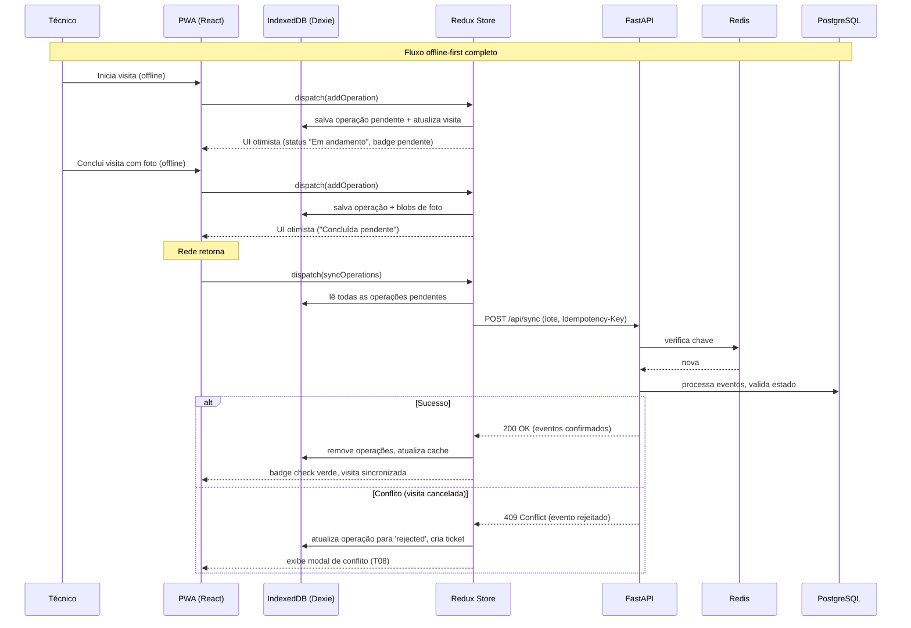
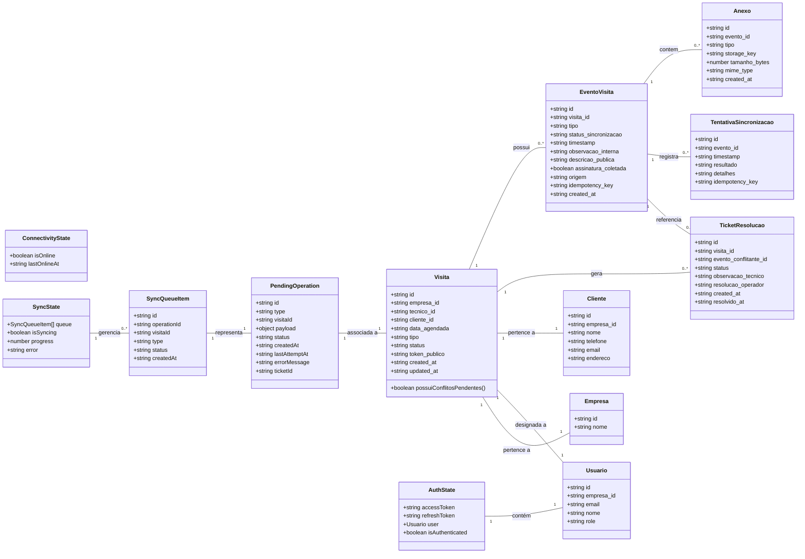

# Estratégia Offline do PWA — Relatório Técnico

Este documento descreve a estratégia completa de funcionamento offline do PWA do técnico de
campo, em conformidade com os requisitos levantados, as ADRs definidas, o modelo de dados (ERD)
e a arquitetura de estado (Redux Toolkit + RTK Query + Dexie.js). O objetivo é garantir que o
técnico possa executar suas atividades essenciais (iniciar e concluir visitas) sem
conectividade, com sincronização automática e tratamento explícito de conflitos.

---

## 1. Armazenamento Local (Offline)

O PWA utiliza IndexedDB como mecanismo de persistência local, acessado por meio da biblioteca
Dexie.js, que oferece uma API simplificada e baseada em Promises. A escolha do IndexedDB
justifica‑se pela capacidade de armazenar grandes volumes de dados estruturados (listas de
visitas, fotos como blobs) e realizar consultas complexas, requisitos não atendidos por
alternativas como localStorage ou Cache API.

### 1.1 Dados armazenados

| Categoria | Dados | Tabela Dexie | Descrição |
|-----------|-------|--------------|-----------|
| Cache de leitura | Visitas do dia, eventos e anexos já sincronizados | visitas, eventos, anexos | Espelho local das respostas da API. Permite consultar visitas e detalhes mesmo offline (T02). Os dados são gravados sempre que uma requisição GET é bem‑sucedida (online) e atualizados após cada sincronização. |
| Fila de operações pendentes | Ações de iniciar e concluir visita, incluindo payload (observação, fotos como blobs) | pendingOperations | Cada operação é registrada com id, type, visitaId, payload, status (pending/failed/rejected), createdAt, lastAttemptAt, errorMessage e ticketId (se conflito). Sobrevive a fechamentos do app e reinicializações (T05). |
| Autenticação | Refresh token criptografado | authTokens | Armazenado de forma segura (criptografia via Web Crypto API) para renovação automática do access token durante a sincronização, mesmo após período offline prolongado (T09). |
| Estado da interface (opcional) | Preferências de UI, último status de conectividade | uiState | Pequenos dados para melhorar a experiência (ex.: tema, filtros). |

**Nota:** As fotos capturadas offline são armazenadas como blobs diretamente na tabela
pendingOperations (dentro do payload) ou em uma tabela auxiliar fotosOffline, e referenciadas
pela operação. Após o upload para o MinIO (via URL pré‑assinada), o blob local é removido para
liberar espaço.

### 1.2 Mecanismos complementares

- **Cache API (via Service Worker):** utilizada para caching de assets estáticos (HTML, JS, CSS)
  e da shell do aplicativo, garantindo carregamento instantâneo offline. Não é usada para dados
  dinâmicos.
- **IndexedDB** permanece como a fonte primária para dados de negócio.

---

## 2. Fila de Operações Pendentes

A fila é o coração do funcionamento offline e segue o padrão de Fila de Eventos com
Idempotência (ADR 2). É gerenciada por um slice do Redux (SyncState) e persistida no Dexie.

### 2.1 Ciclo de vida de uma operação offline

1. **Criação:** o técnico dispara uma ação (ex.: "Iniciar visita"). O componente despacha
   `dispatch(addOperation({ type: 'iniciar', visitaId }))`.

2. **Persistência local:** um middleware Redux (ou listener) intercepta a ação e:
   - Cria um registro na tabela pendingOperations com status 'pending'.
   - Atualiza o estado otimista da visita no Dexie (ex.: status 'em_andamento') e no Redux.
   - Se online, dispara imediatamente a sincronização. Se offline, apenas mantém a operação na
     fila.

3. **Sincronização (ver seção 3):** quando a rede retorna, as operações são enviadas em lotes
   para o endpoint POST /api/sync.

4. **Resolução:**
   - **Sucesso:** a operação é removida da fila e o status local é atualizado com os dados do
     servidor.
   - **Falha temporária (ex.: erro de rede):** status 'failed', exibido ao técnico com opção
     de "Tentar novamente".
   - **Conflito (ex.: visita cancelada):** status 'rejected', um TicketResolucao é criado, e o
     técnico é notificado.

### 2.2 Estrutura da fila no Redux

```typescript
interface SyncState {
  queue: PendingOperation[];      // espelho da tabela Dexie
  isSyncing: boolean;
  progress: number;               // porcentagem ou "3 de 5"
  lastError?: string;
}
```

A UI consome SyncState para exibir o badge de pendências e a barra de progresso (T06, T07).

---

## 3. Sincronização Automática

### 3.1 Disparo

- **Evento online:** um listener no Service Worker ou no aplicativo detecta a mudança e dispara
  o thunk syncOperations.
- **Abertura do app:** ao iniciar, se houver operações pendentes e conectividade, a
  sincronização é iniciada.
- **Retentativas manuais:** o técnico pode tocar em "Tentar novamente" para itens com status
  'failed'.

### 3.2 Fluxo detalhado

1. O thunk lê as operações da tabela pendingOperations ordenadas por createdAt.
2. Agrupa em um lote e gera um idempotency-key (UUID).
3. Envia POST /api/sync com o lote.
   - Antes do envio: se o access token estiver expirado, tenta renovar via refresh token (T09).
     Se falhar, exibe modal de reconexão.
4. Para cada evento no lote, o servidor verifica a idempotency-key (Redis) e processa:
   - Valida regras de negócio (ex.: visita não pode ser concluída se cancelada).
   - Registra o evento com status_sincronizacao = 'sincronizado'.
   - Se conflito: retorna status 409 para o evento específico, e o evento é registrado com
     status_sincronizacao = 'rejeitado'.
   - **Importante:** cada tentativa de sincronização gera um registro em TentativaSincronizacao
     (entidade do ERD) contendo resultado, detalhes e idempotency_key, permitindo auditoria
     futura.
5. Resposta do servidor: array de resultados (sucesso ou conflito por evento).
6. O thunk atualiza o Dexie e o Redux:
   - Remove operações bem‑sucedidas da fila.
   - Para conflitos, marca a operação como 'rejected' e cria um TicketResolucao associado.
   - Atualiza o cache de visitas/eventos com os dados mais recentes.

### 3.3 Upload de fotos

Fotos capturadas offline são tratadas em duas etapas (ADR 5):

1. **Antes do envio do lote:** para cada operação de conclusão com fotos, o thunk solicita URLs
   pré‑assinadas ao backend.
2. **Upload direto:** as fotos são enviadas diretamente ao MinIO.
3. **Metadados no payload:** o evento enviado ao /api/sync contém apenas as URLs e metadados,
   não os blobs.
4. **Em caso de falha no upload:** a foto é mantida localmente até novo upload na próxima
   tentativa.

---

## 4. Tratamento de Conflitos

Conflitos ocorrem quando o estado da visita no servidor é incompatível com a ação offline do
técnico. Exemplo clássico: técnico conclui offline, mas operador cancelou a visita enquanto
isso.

### 4.1 Detecção

O endpoint POST /api/sync processa cada evento do lote e, para ações como 'concluir', verifica
se o status atual da visita permite a conclusão (deve ser 'em_andamento'). Caso contrário,
retorna 409 Conflict, e o evento é registrado com status_sincronizacao = 'rejeitado'.

### 4.2 Resposta do PWA

- A operação na fila passa para status = 'rejected'.
- Um TicketResolucao é criado automaticamente (via API, se online) ou enfileirado como uma
  operação especial.
- O técnico vê um modal de conflito (T08) explicando que a visita foi cancelada pelo escritório
  e seu progresso não pôde ser salvo. Opções: "Abrir Ticket de Resolução" (que envia uma
  mensagem ao operador) ou "Entendi".
- No painel de pendências, o item aparece com status "Rejeitado" e botão para abrir ticket.

### 4.3 Resolução pelo operador

O operador, no Admin, visualiza o ticket na tela de detalhes da visita. Pode aceitar ou rejeitar
as mudanças do técnico, atualizando o resolucao_operador (enum: 'aceita' | 'rejeitada'). Se
aceita, o evento de conclusão é efetivado (status da visita alterado para 'concluido'). Esse
fluxo está fora do PWA, mas o técnico pode ver o resultado quando a visita for sincronizada
novamente.

---

## 5. Sinalização para o Técnico

O PWA comunica o estado da sincronização de forma clara e não intrusiva:

- **Badge de pendências:** ícone na barra superior com contador de operações não sincronizadas
  (T02, T06). Exibe "nuvem cortada" se offline.
- **Status por visita:** cada card mostra um indicador de sincronização:
  - Relógio (pendente)
  - Check verde (sincronizado)
  - X vermelho (rejeitado/conflito)
- **Painel de pendências:** tela dedicada (T06) com lista de ações e status detalhado, incluindo
  mensagem de erro da última tentativa.
- **Barra de progresso:** durante a sincronização ativa, uma barra informa o progresso (ex.:
  "Sincronizando 3 de 5...").
- **Modais de conflito:** exibidos proativamente ao receber 409.
- **Toast notifications:** para confirmações rápidas (ex.: "Visita salva localmente").

---

## 6. Limitações: o que NÃO funciona offline

Embora a arquitetura cubra os fluxos principais, algumas funcionalidades dependem de
conectividade por natureza:

- **Criação de novas visitas:** o técnico não agenda visitas; essa ação é exclusiva do operador.
  Portanto, não precisa funcionar offline.
- **Upload de fotos:** o upload em si só ocorre quando online, mas a captura e o armazenamento
  local funcionam offline. O técnico pode concluir a visita e as fotos serão enviadas assim que
  possível.
- **Notificações push:** o recebimento de novas visitas ou alterações de agenda depende de push
  notification, que requer rede. Entretanto, a agenda já carregada permanece disponível.
- **Acesso à página pública do cliente:** o link público não é acessível offline; mas isso é
  esperado.
- **Abertura de tickets de resolução via API:** se offline, a criação do ticket é enfileirada
  como uma operação e executada na próxima sincronização.
- **Renovação de refresh token:** se o refresh token expirar completamente durante o período
  offline, o técnico precisará fazer login novamente (cenário de T09).

Estas limitações são aceitáveis e estão de acordo com os requisitos levantados, que priorizam a
operação de campo (iniciar e concluir visitas) em modo offline.

---

## Diagrama Resumido — Fluxo Offline-First



---

## Tipagens do PWA (Diagrama de Classes)


