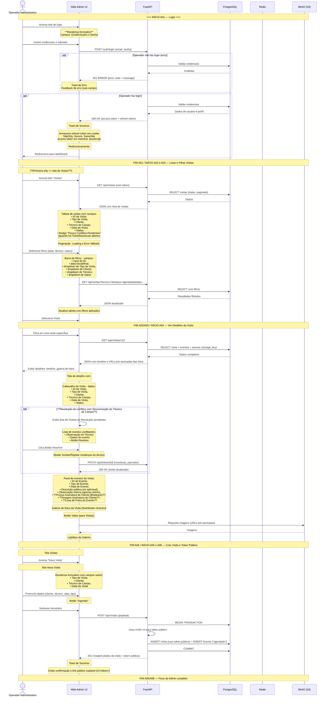

# Diagrama de User Stories — Operador Administrativo (Admin)

## Apresentação

Este diagrama de sequência detalha o fluxo completo de interações do **Operador
Administrativo** com o sistema FieldOps. O Admin utiliza o sistema via navegador desktop em
ambiente de escritório com conexão estável. Suas principais responsabilidades são agendar
visitas técnicas a plantas solares, acompanhar o status da operação em tempo real, visualizar
detalhes de atendimentos (incluindo fotos anexadas pelos técnicos) e gerenciar conflitos de
sincronização quando ações offline dos técnicos colidem com operações realizadas no painel.

O diagrama cobre desde o login até a criação de visitas, passando pela listagem com filtros,
visualização de detalhes com timeline e galeria de fotos, e a geração automática de um token
público para o cliente final acompanhar a visita sem autenticação.

## User Stories cobertas

| ID | História |
|----|----------|
| A01 | Como operador administrativo, quero fazer login no sistema, para acessar as funcionalidades restritas de gestão de visitas. |
| A02 | Como operador, quero visualizar uma lista de todas as visitas agendadas, para acompanhar o status da operação em tempo real. |
| A03 | Como operador, quero filtrar a lista de visitas por data, técnico responsável e status, para localizar rapidamente determinadas ordens de serviço. |
| A04 | Como operador, quero visualizar o detalhe de uma visita, com sua timeline de eventos e fotos anexadas, para ter uma visão completa do atendimento sem precisar contatar o técnico. |
| A05 | Como operador, quero agendar uma nova visita, selecionando o cliente, o técnico, a data/hora e o tipo de serviço (instalação, manutenção, vistoria), para designar corretamente a equipe de campo. |
| A06 | Como operador, quero que o sistema atribua um token único público a cada visita, para que o cliente possa acompanhar o status sem login. |

## Diagrama de Sequência

