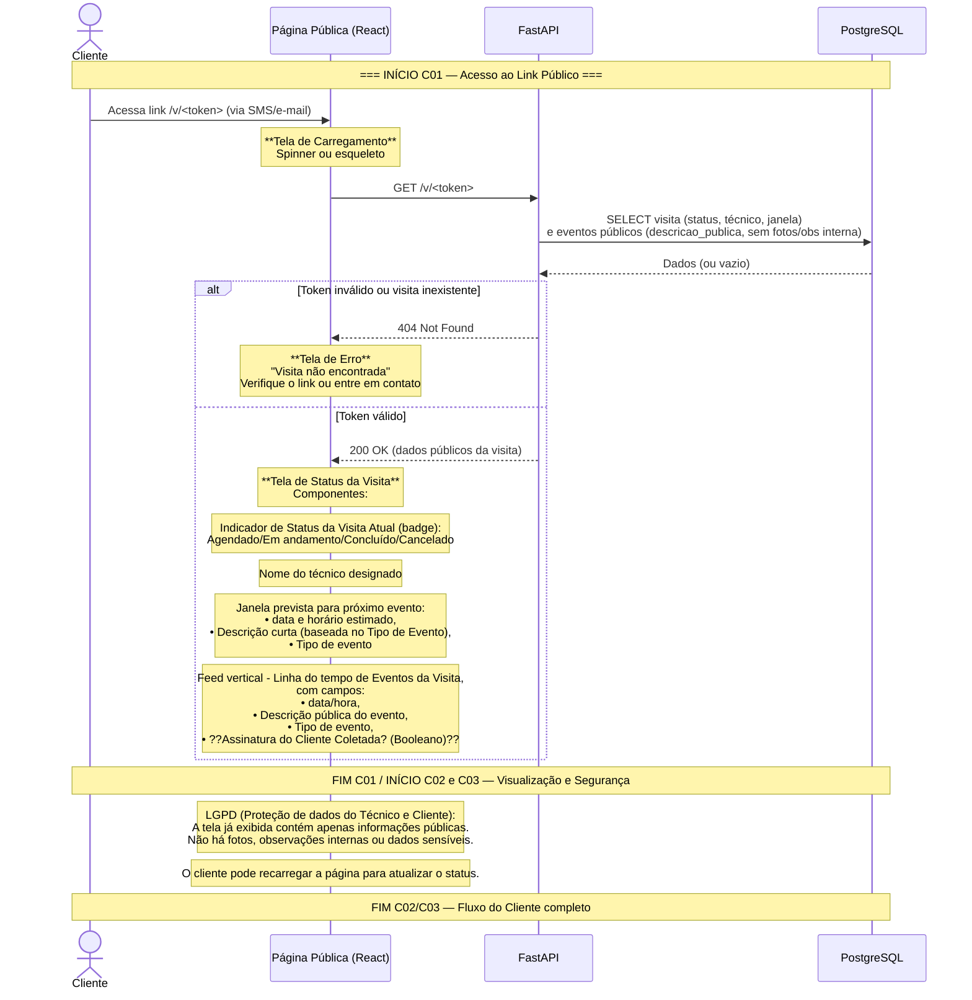

# Diagrama de User Stories — Cliente Final

## Apresentação

Este diagrama de sequência detalha o fluxo de interação do **Cliente Final** com o sistema
FieldOps. O Cliente é o proprietário da planta solar (residencial, comercial ou industrial)
que recebe um link único por SMS ou WhatsApp. Não possui cadastro nem autenticação — acessa
uma página pública onde pode acompanhar o status da visita, saber qual técnico foi designado
e visualizar uma linha do tempo resumida dos eventos, sem exposição de dados sensíveis como
fotos internas ou observações técnicas.

O diagrama cobre o acesso via token público, a exibição segura de informações e o tratamento
de tokens inválidos.

## User Stories cobertas

| ID | História |
|----|----------|
| C01 | Como cliente, quero acessar um link único (URL) que recebi por SMS/e-mail, para acompanhar o status da minha visita sem precisar de login. |
| C02 | Como cliente, quero ver na página pública: status atual, nome do técnico designado, janela de horário prevista e uma linha do tempo resumida, para saber quando a equipe chegará e o que já foi feito. |
| C03 | Como cliente, quero que a página pública seja segura e não exponha dados sensíveis (fotos, observações internas), para proteger minha privacidade e dados do meu sistema solar. |

## Diagrama de Sequência

