# Diagrama de User Stories — Técnico de Campo

## Apresentação

Este diagrama de sequência detalha o fluxo completo de interações do **Técnico de Campo** com
o sistema FieldOps. O Técnico utiliza um PWA instalado em seu celular, frequentemente em áreas
com conectividade instável ou inexistente. Suas principais atividades são visualizar a agenda
do dia, registrar o início e a conclusão de visitas técnicas (com observações e fotos), e
contar com um mecanismo de sincronização automática que envia seus dados ao servidor assim que
a conexão for restaurada.

O diagrama cobre desde o login offline-aware até o tratamento explícito de conflitos, quando
uma ação realizada offline (ex.: concluir visita) colide com uma operação concorrente do
operador administrativo (ex.: cancelamento da mesma visita). A fila de pendências, a barra de
progresso de sincronização e a renovação transparente de tokens são aspectos centrais da
experiência do técnico.

## User Stories cobertas

| ID | História |
|----|----------|
| T01 | Como técnico, quero fazer login no PWA, para acessar minha agenda de visitas do dia. |
| T02 | Como técnico, quero visualizar "Minhas visitas do dia" mesmo sem conexão com a internet, para saber quais clientes devo atender quando estou em área remota. |
| T03 | Como técnico, quero registrar o início de uma visita (com timestamp local), para que o sistema saiba que comecei o atendimento, mesmo offline. |
| T04 | Como técnico, quero concluir uma visita, adicionando observações e fotos do serviço (painéis, inversores, etc.), para documentar o que foi feito e eventuais problemas encontrados. |
| T05 | Como técnico, quero que a conclusão da visita e o upload das fotos funcionem offline, ficando na fila de sincronização, para não interromper meu trabalho quando o sinal está fraco. |
| T06 | Como técnico, quero ver uma fila de itens pendentes de sincronização, para saber o que ainda não foi enviado ao servidor. |
| T07 | Como técnico, quero que o aplicativo sincronize automaticamente quando a conexão for restaurada, para que minhas ações cheguem ao sistema sem que eu precise fazer nada. |
| T08 | Como técnico, quero ser claramente informado se uma sincronização falhar ou se houver um conflito (ex.: a visita foi cancelada pelo admin enquanto eu estava offline), para tomar a ação adequada. |
| T09 | Como técnico, quero que o token de autenticação seja renovado automaticamente, mesmo se expirar durante o período offline, para que a sincronização não seja rejeitada por falta de credenciais. |

## Diagrama de Sequência

```mermaid
sequenceDiagram
    actor T as Técnico de Campo
    participant PWA as PWA UI (React + Service Worker)
    participant IDB as IndexedDB (Dexie)
    participant Fila as Fila Local (IndexedDB)
    participant API as FastAPI
    participant Redis as Redis
    participant DB as PostgreSQL
    participant S3 as MinIO (S3)

    Note over T,S3: === INÍCIO T01 — Login no PWA ===

    T->>PWA: Abre o app
    Note over PWA: **Tela de Login**<br>Campos: Email/Usuário e Senha<br>Botão "Entrar"
    T->>PWA: Insere credenciais e submete
    PWA->>API: POST /auth/login (email, senha)
    opt Falha no login
        API->>DB: Valida credenciais
        DB-->>API: Inválidas
        API-->>PWA: 401 Unauthorized
        Note over PWA: Toast de erro<br>Feedback campo a campo
    end
    opt Sucesso
        API->>DB: Valida credenciais
        DB-->>API: Dados do técnico + perfil
        API-->>PWA: 200 OK (access token + refresh token)
        Note over PWA: Toast de sucesso
        PWA->>IDB: Armazena tokens (criptografados)
        PWA->>PWA: Armazena refresh token em memória
        Note over PWA: Redireciona para "Minhas Visitas"
    end

    Note over T,S3: FIM T01 / INÍCIO T02 — Minhas Visitas do Dia (offline)

    PWA->>PWA: Verifica conectividade
    Note over PWA: Na barra Superior do App:<br>Ícone de Conectividade (ícone de relógio ou nuvem cortada)<br>Contador de itens na fila
    note over PWA: Pull-to-refresh (se online)
    alt Online (primeira carga ou reconectado)
        PWA->>API: GET /api/tecnicos/me/visitas?data=hoje
        API->>DB: SELECT visitas do técnico para hoje
        DB-->>API: Dados
        API-->>PWA: JSON com lista de visitas
        PWA->>IDB: Salva/atualiza visitas no cache local
    else Offline (dados já carregados anteriormente)
        PWA->>IDB: Busca visitas do dia
        IDB-->>PWA: Lista de visitas armazenadas
    end
    Note over PWA: **Tela "Minhas Visitas"**<br>Lista de cards:<br>• Cliente, Endereço<br>• Horário previsto<br>• Tipo de serviço (instalação/manutenção/vistoria)<br>• Status (Agendado/Em andamento/Concluído)<br>• Status Sincronização (Pendente/Falhou/Recusada)
    note over PWA: Fallbacks de estado vazio (sem visitas)/Loading

    Note over T,S3: FIM T02 / INÍCIO T03 — Iniciar Visita (offline)

    Note over PWA: Card em Tela Minhas Visitas
    Note over PWA: Botão de "Iniciar Visita"
    T->>PWA: Toca "Iniciar" em uma visita
    Note over PWA: Confirmação rápida (modal/toast)
    opt ??Assinatura Opcional do Cliente??
        Note over PWA: ??Coleta Assinatura do Cliente (Para Evento de Início)??
        PWA->>PWA: ??Verifica se há assinatura do Cliente??
        note over PWA: Formulário com Campos:<br>• Desenho da assinatura,<br>• Timestamp início (pré-preenchido automaticamente),<br>• Local (pré-preenchido automaticamente)
    end
    T->>PWA: Confirma início
    Note over PWA: **Tela de Visita**
    PWA->>IDB: Cria evento local "iniciado"<br>timestamp = now()
    PWA->>IDB: Atualiza status da visita → "Em andamento"
    Note over PWA: Atualiza card da visita:<br>• Status - "Em andamento"<br>• timestamp local de início,<br>• Sincronização Pendente? (Badge).
    PWA->>PWA: Checa se está Offline??
    PWA->>IDB: Registra Operação<br>(tipo: iniciar, visita_id, timestamp)
    IDB->>IDB: Operação Offline??
    IDB->>Fila: Adiciona operação pendente<br>(tipo: iniciar, visita_id, timestamp)
    Note over PWA: Badge de Sincronização Pendente (relógio)
    Note over PWA: Na barra Superior do App:<br>Ícone de Conectividade (ícone de relógio ou nuvem cortada)<br>Contador de itens na fila
    Fila-->>PWA: Visita iniciada (salva localmente)

    Note over T,S3: FIM T03 / INÍCIO T04 e T05 — Concluir Visita com Obs. e Fotos (e Assinatura do Cliente??) (offline)

    Note over PWA: **Tela de Visita**
    note over PWA: Botão "Concluir atendimento" (no card)
    T->>PWA: Abre visita "Em andamento"<br>e toca "Concluir atendimento"
    Note over PWA: **Tela de Conclusão de Atendimento**
    Note over PWA: Formulário com campos:<br>• Observação (textarea)<br>• Botão: "Adicionar foto" (câmera/galeria)<br>• Grade de miniaturas das Fotos Adicionadas

    opt ??Assinatura Opcional do Cliente??
        Note over PWA: ??Coleta Assinatura do Cliente (Para Evento de Conclusão)??
        PWA->>PWA: ??Verifica se há assinatura do Cliente??
        note over PWA: Formulário com Campos:<br>• Desenho da assinatura,<br>• Timestamp conclusão (pré-preenchido automaticamente),<br>• Local (pré-preenchido automaticamente)
    end

    T->>PWA: Preenche observação
    T->>PWA: Adiciona fotos (até 20, ~5MB cada)
    PWA->>PWA: Checagem Tamanho do Arquivo
    PWA->>IDB: Salva blobs das fotos localmente<br>e gera miniaturas
    note over PWA: Botão "Concluir atendimento"<br>(na tela de conclusão)
    T->>PWA: Toca "Concluir"
    PWA->>IDB: Cria evento local "concluído"<br>com observação e refs das fotos
    PWA->>IDB: Atualiza status da visita → "Pendente sincronização"
    PWA->>Fila: Adiciona operação pendente<br>(tipo: concluir, payload: obs + fotos)
    Note over PWA: Toast: "Visita salva localmente.<br>Sincronização pendente."
    Note over PWA: Card da visita mostra:<br>• Status da Visita "Visita Concluída",<br>• Status de Sincronização: Sincronização Pendente (Ícone de nuvem cortada)
    Note over PWA: Na barra Superior do App:<br>Ícone de Conectividade (ícone de relógio ou nuvem cortada)<br>Contador de itens na fila SOBE DE VALOR

    Note over T,S3: FIM T04/T05 / INÍCIO T06 — Fila de Sincronização

    Note over PWA: Na barra Superior do App:<br>Clica ícone de Conectividade + Contador de Pendências de Sincronização
    T->>PWA: Clica Botão "Painel de Pendências"
    PWA-->>T: Redireciona para Painel de Pendências
    Note over PWA: **Painel de Pendências de Sincronização**
    Note over PWA: Tabela de Pendências de Sincronização - campos:<br>• Id da Visita,<br>• Tipo de ação + Ícone (iniciar/concluir),<br>• Nome do cliente,<br>• Horário local da ação<br>• Status Última Tentativa de Sincronização (pendente, falhou, rejeitada),<br>• Motivo de falha,<br>• Botão "Tentar novamente" OU Botão "Abrir Ticket de Resolução" (Quando Rejeitada)
    PWA->>Fila: Lê todas as operações pendentes
    Fila-->>PWA: Lista de pendências
    Note over PWA: Exibe itens com opção<br>"Tentar novamente" (se falhou)

    Note over T,S3: FIM T06 / INÍCIO T07 — Sincronização Automática (volta online)

    Note over T,PWA: Evento: rede volta (online)
    PWA->>PWA: Detecta evento 'online'
    Note over PWA: Na barra Superior do App:<br>Spinner
    PWA->>Fila: Lê todas as operações pendentes<br>(ordenadas por timestamp)
    loop Para cada lote de operações
        PWA->>PWA: Gera idempotency-key (UUID)
        Note over PWA: Barra de progresso:<br>"Sincronizando 3 de 5..."
        opt Token expirado (T09)
            API-->>PWA: 401 Unauthorized
            PWA->>API: POST /auth/refresh (refresh token)
            alt Refresh sucesso
                API-->>PWA: Novo access token
                PWA->>IDB: Atualiza token
                PWA->>API: Retenta POST /api/sync
            else Refresh falha
                Note over PWA: Toast: "Sessão expirada - Refresh de Token falhou"
                Note over PWA: Na barra superior do App:<br>Ícone de Token desatualizado (Como Status de Conectividade)
                Note over PWA: No topo da tela de Pendências de Sincronização, abaixo da barra superior:<br>Mensagem de Token desatualizado + Botão de nova tentativa
                opt Clica em Nova Tentativa
                    Note over PWA: Abre Modal de Reinserção de Credenciais de Login:<br>Sem Redirecionamento ou Logoff
                    T->>PWA: Insere Credenciais
                    PWA->>API: POST /auth/login (email, senha)
                    API-->>PWA: 200 OK (novo access token + novo refresh token)
                    PWA->>IDB: Atualiza token
                    PWA->>API: Retenta POST /api/sync
                end
            end
        end

        Note over PWA,S3: Upload de fotos pendentes (ADR 5)
        loop Para cada operação com fotos
            PWA->>API: POST /api/visitas/{id}/fotos/upload-url (storage_key, mime_type)
            API-->>PWA: URL pré-assinada + storage_key
            PWA->>S3: PUT foto (upload direto com URL pré-assinada)
            S3-->>PWA: 200 OK
            PWA->>API: POST /api/visitas/{id}/fotos/confirm (storage_key, tamanho, mime_type)
            API-->>PWA: 201 Created (metadados registrados)
        end

        PWA->>API: POST /api/sync<br>Header: Idempotency-Key<br>Body: lote de eventos (tipo, visita_id, payload com URLs das fotos, timestamp)
        API->>Redis: Verifica idempotency-key
        alt Key nova
            Redis-->>API: Não existe
            API->>DB: Processa cada evento do lote
            DB-->>API: Resultados (sucesso/conflito)
            API->>Redis: Armazena key com resultado (TTL 24h)
            API-->>PWA: 200 OK (array de resultados por evento)
        else Key duplicada
            Redis-->>API: Resultado em cache
            API-->>PWA: 200 OK (resultado anterior)
        end
        alt Evento processado com sucesso
            PWA->>Fila: Remove operação da fila (Fila de Pendências de Sincronização)
            PWA->>IDB: Atualiza status da visita → "Concluída"<br>e salva resposta do servidor
            Note over PWA: Badge de check verde no card
        else Conflito (ex.: visita cancelada)
            API-->>PWA: 409 Conflict (detalhes)
            Note over PWA: Aciona fluxo de conflito (T08)
        end
    end
    Note over PWA: Sincronização concluída<br>Atualiza UI com status finais
    Note over PWA: Na barra Superior do App:<br>Ícone de Sincronizado

    Note over T,S3: FIM T07/T09 / INÍCIO T08 — Conflito na Sincronização

    Note over PWA: Ao receber 409 Conflict:<br>"Visita #123 foi cancelada pelo operador"
    Note over PWA: No Painel de Conflitos Atualiza o Status de Sincronização, Motivo de falha e botão
    PWA-->>T: Exibe modal de conflito
    Note over PWA: **Modal de Conflito**<br>Mensagem: "A visita [cliente] foi cancelada<br>pelo escritório enquanto você estava offline.<br>Seu progresso não pôde ser salvo."<br>Botão: "Abrir Ticket de Resolução"
    opt Ao Abrir Ticket de Resolução
        Note over PWA: Mock de Modal - Ticket de Resolução:<br>• Enviar Mensagem,<br>• Ligar
    end
    T->>PWA: Dispensa modal
    PWA->>IDB: Atualiza status local → "Cancelada"
    PWA->>Fila: Remove operação conflitante
    Note over PWA: Card da visita atualizado<br>Status: "Rejeitada" (vermelho)

    Note over T,S3: FIM T08 — Fluxo do Técnico completo
```

